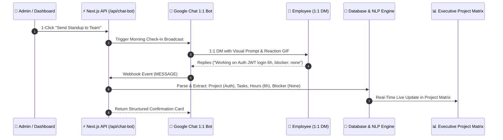

# 🤖 BytePx StandupPulse — Executive Standup Dashboard & Google Chat Bot

> **An intelligent Daily Standup Suite & Official Google Chat 1:1 Bot:** Automatically messages employees in direct 1:1 Google Chat DMs with humorous prompts & reaction GIFs, extracts their tasks, hours, project allocations, and blockers with intelligent NLP parsing, and transforms everything into real-time executive intelligence for leadership.

---

## 🌟 Architecture & Data Flow



---

## 📂 Clean Project Structure

```text
BytePx-StandupPulse/
├── app/                                 # Next.js 14 App Router
│   ├── api/                             # Serverless API Webhook Routes
│   │   ├── chat-bot/route.ts            # Google Chat Webhook (NLP parser & CardsV2 response)
│   │   ├── employees/route.ts           # Team Directory CRUD
│   │   ├── settings/route.ts            # Company & Bot Configuration
│   │   ├── standups/route.ts            # Standup logs endpoint
│   │   └── trigger-bot/route.ts         # 1-Click Broadcast Dispatcher
│   ├── globals.css                      # Tailwind CSS & Glassmorphism design tokens
│   ├── layout.tsx                       # Root layout & font optimization
│   └── page.tsx                         # Executive Project Matrix & Standup Dashboard
├── data/                                # Persistent Seed & Local Storage
│   ├── employees.json                   # Team members list
│   ├── settings.json                    # Workspace settings & Apps Script URL
│   └── standups.json                    # Daily standup records
├── google-chat-bot/                     # Apps Script Direct 1:1 Dispatcher
│   ├── Code.gs                          # 1-Click direct 1:1 DM broadcast engine
│   └── appsscript.json                  # Manifest configuration
├── lib/                                 # Core Business Logic & Adapters
│   ├── db.ts                            # Universal database adapter (Local + Serverless /tmp)
│   ├── parser.ts                        # Intelligent Standup NLP Regex/Keyword Parser
│   └── types.ts                         # Strongly typed TypeScript interfaces
├── next.config.js                       # Next.js production configuration
├── package.json                         # Scripts & clean dependencies
├── postcss.config.js                    # PostCSS Tailwind plugin
├── tailwind.config.ts                   # Tailwind theme & color tokens
└── tsconfig.json                        # TypeScript configuration
```

---

## 🚀 Key Features

1. **📁 By Project & Initiative View**:
   - Visual cards grouping team members under their active project.
   - Sums allocated hours per initiative and flags blocker alerts.

2. **🧠 Intelligent NLP Parser**:
   - Accurately identifies explicit and inferred projects (e.g. `Auth & Security`, `Core API`, `Mobile App`, `Payment & Billing`).
   - Parses work hours, task descriptions, and blockers.

3. **🤖 Google Chat 1:1 Bot Engine**:
   - Messages employees in individual 1:1 DMs (no crowded group spaces).
   - Rotating humorous morning check-in prompts & verified unblocked 3D reaction GIFs.

4. **📋 1-Click Executive Actions**:
   - **Copy Briefing**: Generates a clean markdown briefing ready for Slack, WhatsApp, or Email.
   - **Export CSV**: Instant spreadsheet data download.
   - **Send Standup to Team**: Broadcasts check-in to all employees with one click.

---

## 🛠️ Local Development

```bash
# 1. Install dependencies
npm install

# 2. Start local development server
npm run dev
```

Open [http://localhost:3000](http://localhost:3000) in your browser.

---

## ☁️ Deployment (Vercel)

This project is built natively for **Vercel**:

1. Push to your GitHub repository:
   ```bash
   git push origin main
   ```
2. In [Vercel Dashboard](https://vercel.com/new), import your repository.
3. In **Google Cloud Console ➔ Google Chat API ➔ Configuration**:
   - Set **Connection settings** to **HTTP endpoint URL**.
   - Paste: `https://your-vercel-domain.vercel.app/api/chat-bot`.
   - Click **Save**.
