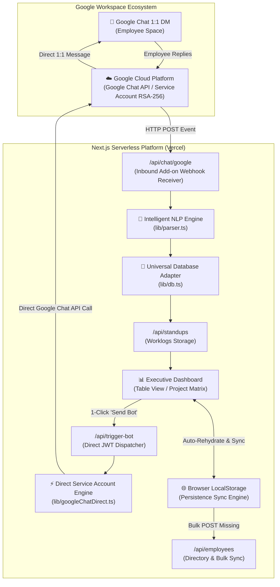
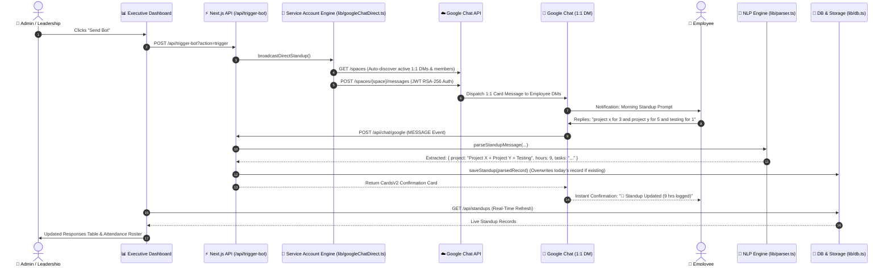

# 🤖 StandupPulse — Intelligent Enterprise Standup Suite & Google Chat 1:1 Bot

[](https://nextjs.org/)
[](https://reactjs.org/)
[](https://www.typescriptlang.org/)
[](https://tailwindcss.com/)
[](https://developers.google.com/chat)
[](https://opensource.org/licenses/MIT)

> **StandupPulse** is an enterprise-grade Daily Standup Automation Suite and Google Chat 1:1 Bot. It automatically engages team members in individual 1:1 direct messages on Google Chat with interactive morning prompts, extracts multi-project tasks, hours, and blockers using an intelligent NLP parser, supports live standup overrides, and presents leadership with a real-time executive dashboard featuring structured response tables, initiative matrices, and 1-click briefing exports.

---

## 📑 Table of Contents

- [1. Executive & Functional Overview](#1-executive--functional-overview)
  - [Key Capabilities](#key-capabilities)
  - [User Personas & Workflows](#user-personas--workflows)
- [2. System Architecture](#2-system-architecture)
  - [High-Level Architectural Diagram](#high-level-architectural-diagram)
  - [End-to-End Sequence Flow](#end-to-end-sequence-flow)
- [3. Functional Specifications](#3-functional-specifications)
  - [Google Chat 1:1 Bot Experience](#google-chat-11-bot-experience)
  - [NLP Multi-Project Parsing Engine](#nlp-multi-project-parsing-engine)
  - [Standup Update & Override Workflow](#standup-update--override-workflow)
  - [Executive Responses Table & Project Matrix](#executive-responses-table--project-matrix)
  - [Live Date View Filtering (`Today` vs `All History`)](#live-date-view-filtering-today-vs-all-history)
  - [Multi-Tier Team Persistence Layer](#multi-tier-team-persistence-layer)
- [4. Technical Specifications](#4-technical-specifications)
  - [Tech Stack](#tech-stack)
  - [Directory Structure](#directory-structure)
  - [API Endpoints Reference](#api-endpoints-reference)
  - [Data Models & Schema](#data-models--schema)
- [5. Installation & Setup Guide](#5-installation--setup-guide)
  - [Prerequisites](#prerequisites)
  - [Step 1: Local Setup & Dependencies](#step-1-local-setup--dependencies)
  - [Step 2: Google Cloud Platform (GCP) Configuration](#step-2-google-cloud-platform-gcp-configuration)
  - [Step 3: Service Account & Dispatcher Setup](#step-3-service-account--dispatcher-setup)
  - [Step 4: Linking Settings to Dashboard](#step-4-linking-settings-to-dashboard)
  - [Step 5: Deploying to Vercel](#step-5-deploying-to-vercel)
- [6. Operations & Troubleshooting](#6-operations--troubleshooting)
  - [Common Questions & Resolutions](#common-questions--resolutions)
- [7. Security & Compliance](#7-security--compliance)

---

## 1. Executive & Functional Overview

### Key Capabilities

1. **Direct 1:1 Google Chat Experience**:
   - Zero group channel clutter. The bot contacts each team member individually in their private 1:1 Google Chat DM space.
   - Dynamic morning prompts with motivational greetings and interactive CardsV2 widgets.
2. **Effortless Conversational NLP Parsing**:
   - Team members reply naturally in chat without rigid form wizards.
   - Example reply: `project X for 3 hours and on project y for 5 hours and testing for 1`
   - The NLP engine automatically extracts multiple projects, sums hours ($3 + 5 + 1 = 9\text{h}$), structures itemized tasks, and extracts blocker alerts.
3. **Live Standup Updates & Overrides**:
   - If an employee's plan changes during the day, replying with an updated worklog automatically **overwrites** their previous record for today and updates the dashboard instantly.
4. **Executive Dashboard & Daily Attendance**:
   - Real-time attendance tracker (**Checked In Today** vs **Pending Response**).
   - Date View Switcher (**`🟢 Today`** vs **`📅 All History`**).
   - High-density table view with itemized task tags, total hours progress badges, and blocker alerts.
   - Grid cards view for grouping tasks by project initiatives.
5. **Permanent Employee Directory**:
   - Multi-tier synchronization ensuring team members persist permanently across serverless deployments.
6. **1-Click Executive Actions**:
   - **Send Bot**: Instant broadcast to all team members.
   - **Nudge Pending**: Targeted follow-up reminders to members who haven't logged today's standup.
   - **Copy Briefing**: Generates clean Markdown briefings formatted for Slack, WhatsApp, or Email.
   - **Export CSV**: Instant spreadsheet data download.

---

## 2. System Architecture

### High-Level Architectural Diagram



### End-to-End Sequence Flow



---

## 3. Functional Specifications

### Google Chat 1:1 Bot Experience
- **Isolation**: Each employee receives standup prompts in their private 1:1 DM channel with the bot.
- **Engagement**: The bot sends clean CardsV2 interactive cards containing greetings and actionable hours selection widgets.
- **Confirmation**: Upon receiving an employee's message, the bot immediately replies with a confirmation card displaying the parsed task summary, project breakdown, and total hours logged.

### NLP Multi-Project Parsing Engine
The parser (`lib/parser.ts`) extracts worklog information using flexible conversational patterns:
1. **Multi-Project & Multi-Hour Summation**:
   - Parses multi-segment phrases: `"project x for 3 and project y for 5 and testing for 1"` $\rightarrow$ combines into `Project X + Project Y + Testing` with $9.0\text{ hrs}$ total.
2. **Project Recognition**:
   - Supports prefixes (`project Apollo`), suffixes (`Cygnos project`), quotes (`"AI adoption"`), and keyword categorization.
3. **Itemized Tasks**:
   - Automatically splits tasks across commas, semicolons, bullet points, and newlines into structured itemized tags (`Task 1`, `Task 2`, `Task 3`).
4. **Blocker Detection**:
   - Flags patterns like `blocker: ...`, `blocked by ...`, `waiting for ...`, `issue with ...`.

### Standup Update & Override Workflow
- Standup check-ins are uniquely keyed by **Employee Email + Date**.
- If an employee submits an initial standup and later sends an updated breakdown, the system overwrites the record for today and displays an updated confirmation card (`"🔄 Standup Updated"`).

### Live Date View Filtering (`Today` vs `All History`)
- **`🟢 Today (Live)`** *(Default)*: Isolates today's check-ins, sets attendance to 0 at the start of each morning, and places all team members in **"Pending Response"** until they log their tasks for today.
- **`📅 All History`**: Allows viewing historical logs across past days with full date badges.

---

## 4. Technical Specifications

### Tech Stack
| Component | Technology | Description |
| :--- | :--- | :--- |
| **Framework** | Next.js 14.2 (App Router) | Serverless API routes and React SSR/CSR |
| **Frontend** | React 18, Tailwind CSS | High-density Obsidian Black + Emerald theme |
| **Icons** | Lucide React | Clean, scalable vector iconography |
| **Bot Engine** | Google Chat Cards V2 & Webhooks | Interactive cards and direct event handling |
| **Direct Auth** | Google Service Account (JWT RSA-256) | Direct Google Chat API 1:1 DM delivery |
| **Storage** | Universal Database Adapter (`lib/db.ts`) | Hybrid Local / Ephemeral `/tmp` storage |
| **Hosting** | Vercel Serverless Platform | Edge-optimized deployment |

### Directory Structure

```text
StandupPulse/
├── app/                                 # Next.js 14 App Router
│   ├── api/                             # Serverless API Webhook Routes
│   │   ├── chat/google/route.ts         # Primary Google Chat Webhook (NLP & CardsV2)
│   │   ├── employees/route.ts           # Team Directory CRUD & Bulk Sync
│   │   ├── settings/route.ts            # Company & Schedule Configuration
│   │   ├── standups/route.ts            # Standup Records CRUD
│   │   └── trigger-bot/route.ts         # 1-Click Broadcast & Nudge Dispatcher
│   ├── globals.css                      # Tailwind CSS & design tokens
│   ├── layout.tsx                       # Root layout & Google Fonts optimization
│   └── page.tsx                         # Executive Standup Dashboard & Responses Table
├── data/                                # Persistent Seed & Storage
│   ├── employees.json                   # Team members list (Seed)
│   ├── settings.json                    # Workspace settings
│   └── standups.json                    # Daily standup records
├── google-chat-bot/                     # Apps Script Direct 1:1 Dispatcher (Optional)
│   ├── Code.gs                          # 1:1 DM broadcast & direct message engine
│   └── appsscript.json                  # Manifest configuration
├── lib/                                 # Core Business Logic & Adapters
│   ├── db.ts                            # Universal database adapter
│   ├── googleChatDirect.ts              # Service Account direct DM engine
│   ├── googleChatHelper.ts              # CardsV2 builders & formatters
│   ├── parser.ts                        # Intelligent Standup NLP Regex Parser
│   └── types.ts                         # Strongly typed TypeScript interfaces
├── next.config.js                       # Next.js configuration
├── package.json                         # Dependencies & project scripts
├── tailwind.config.ts                   # Tailwind theme tokens & color palettes
├── tsconfig.json                        # TypeScript configuration
└── vercel.json                          # Vercel Cron schedule configuration
```

### API Endpoints Reference

#### `POST /api/chat/google`
- **Description**: Inbound webhook receiver for Google Workspace Add-on Chat events.
- **Events Handled**:
  - `MESSAGE`: Parses employee's text response, handles capacity checks, updates drafts, and saves standup records.
  - `ADDED_TO_SPACE`: Returns a welcoming onboarding card.
  - `CARD_CLICKED`: Processes 1-click hour buttons and remaining capacity actions.

#### `POST /api/trigger-bot?action=trigger|nudge`
- **Description**: Dispatches standup check-in broadcast or targeted follow-up nudges directly to active employee 1:1 DM spaces.

#### `GET /api/employees` | `POST /api/employees` | `DELETE /api/employees?email=...`
- **Description**: Manages employee directory with bulk synchronization support.

#### `GET /api/standups` | `POST /api/standups` | `DELETE /api/standups?id=...`
- **Description**: Retrieves and manages standup records.

#### `GET /api/settings` | `POST /api/settings`
- **Description**: Manages workspace schedule, nudge intervals, and prompts.

---

## 5. Installation & Setup Guide

### Prerequisites
1. **Node.js**: v18.17.0 or higher.
2. **Google Cloud Platform (GCP)** Account with Google Chat API enabled.
3. **Google Workspace Account** (with Google Chat enabled).
4. **Vercel Account** (for production deployment).

---

### Step 1: Local Setup & Dependencies

```bash
# 1. Clone the repository
git clone https://github.com/RudraSharma3/ChucklePulse.git
cd ChucklePulse

# 2. Install dependencies
npm install

# 3. Run development server
npm run dev
```

Open [http://localhost:3000](http://localhost:3000) in your browser.

---

### Step 2: Google Cloud Platform (GCP) Configuration

1. Go to the [Google Cloud Console](https://console.cloud.google.com/).
2. Create a project (e.g. `Company-Standup-Bot`).
3. Navigate to **APIs & Services ➔ Library**, search for **Google Chat API**, and click **Enable**.
4. Navigate to **Google Chat API ➔ Configuration**:
   - **App name**: `Standup Bot`
   - **Avatar URL**: `https://ssl.gstatic.com/images/branding/product/1x/avatar_circle_blue_512dp.png`
   - **Description**: `Official 1:1 Daily Standup Bot`
   - **Functionality**:
     - Check ✅ **Receive 1:1 messages**
     - Check ✅ **Join spaces and group conversations**
   - **Connection settings**: Select **HTTP endpoint URL**
   - **HTTP endpoint URL**:
     `https://your-vercel-domain.vercel.app/api/chat/google`
   - **Visibility**: Select **Specific people and groups in your domain** or **Everyone in your organization**.
5. Click **Save**.

---

### Step 3: Service Account & Dispatcher Setup

1. In GCP, go to **IAM & Admin ➔ Service Accounts**.
2. Create a service account named `standup-bot-sa`.
3. Generate and download a JSON Private Key.
4. Set the JSON key string as an environment variable in Vercel:
   - Variable name: `GOOGLE_SERVICE_ACCOUNT_KEY`
   - Value: *(paste the complete JSON content of your service account key)*

---

### Step 4: Deploying to Vercel

1. Push your repository to GitHub:
   ```bash
   git add .
   git commit -m "Configure StandupPulse Suite"
   git push origin main
   ```
2. In the [Vercel Dashboard](https://vercel.com/new), import your repository.
3. Configure Environment Variables (`GOOGLE_SERVICE_ACCOUNT_KEY`).
4. Click **Deploy**.

---

## 6. Operations & Troubleshooting

### Common Questions & Resolutions

| Question / Symptom | Root Cause | Resolution |
| :--- | :--- | :--- |
| **"Standup prompt arrived at 10:46 AM instead of 10:30 AM"** | Vercel Cron jobs on Hobby accounts run on a best-effort shared queue that can experience 10-15m latency. | Click **"Send Bot"** on the dashboard anytime for instant dispatch, or set a precise 10:30:00 AM Google Apps Script time trigger. |
| **"Employee did not receive the bot's 1:1 prompt"** | The employee has not opened a direct chat with the bot yet in Google Chat. | Ask the employee to open Google Chat, search for the Standup Bot, and send `hi`. Google Chat will create their 1:1 DM space, and all future broadcasts deliver instantly. |
| **"Employee replied with updated hours and tasks"** | Employee wanted to revise their earlier standup. | The system automatically matches today's date and replaces/overwrites their previous record, updating the dashboard immediately. |

---

## 7. Security & Compliance

- **Zero Third-Party Data Sharing**: Standup logs remain securely within your deployed application instance and Google Workspace environment.
- **Enterprise Isolation**: Direct 1:1 messaging ensures team members' standups are collected privately without public channel exposure.
- **Role-Based Admin Actions**: Centralized controls for nudging, broadcasting, and configuration directly via the leadership dashboard.

---

<div align="center">
  <sub>Built with ❤️ for Company. Engineered for seamless, high-performance daily engineering standups.</sub>
</div>
