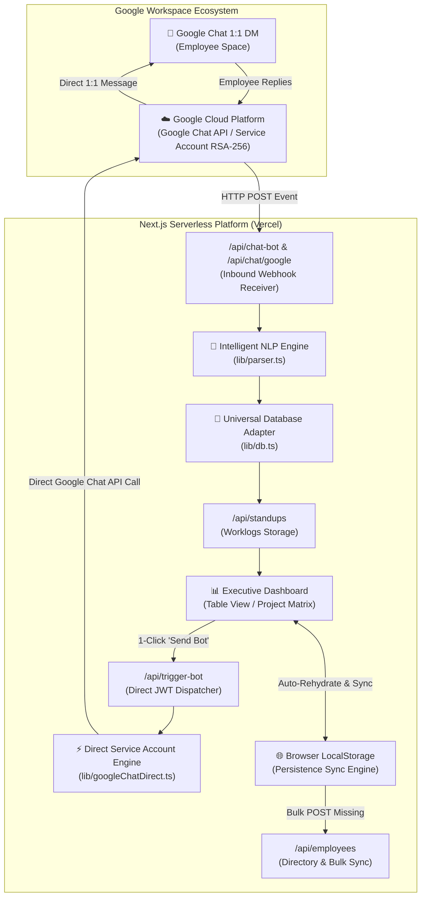
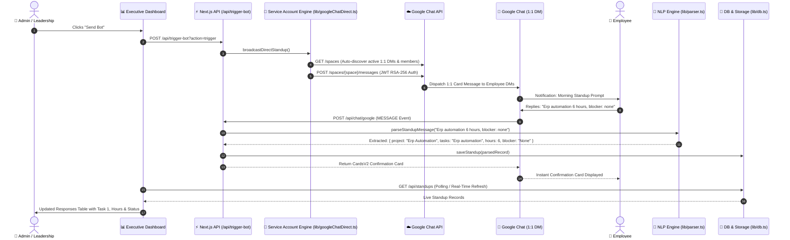

# 🤖 BytePx StandupPulse — Intelligent Standup Suite & Google Chat 1:1 Bot

[](https://nextjs.org/)
[](https://reactjs.org/)
[](https://www.typescriptlang.org/)
[](https://tailwindcss.com/)
[](https://developers.google.com/chat)
[](https://opensource.org/licenses/MIT)

> **BytePx StandupPulse** is an enterprise-grade Daily Standup Automation Suite and Google Chat 1:1 Bot. It automatically engages employees in individual 1:1 direct messages on Google Chat with engaging morning prompts, extracts their tasks, project allocations, hours, and blockers using an intelligent NLP parser, and presents leadership with a real-time executive dashboard featuring structured table views, initiative matrices, and 1-click briefing exports.

---

## 📑 Table of Contents

- [1. Executive & Functional Overview](#1-executive--functional-overview)
  - [Key Capabilities](#key-capabilities)
  - [User Personas & Workflows](#user-personas--workspaces)
- [2. System Architecture](#2-system-architecture)
  - [High-Level Architectural Diagram](#high-level-architectural-diagram)
  - [End-to-End Sequence Flow](#end-to-end-sequence-flow)
- [3. Functional Specifications](#3-functional-specifications)
  - [Google Chat 1:1 Bot Experience](#google-chat-11-bot-experience)
  - [NLP Message Parsing Engine](#nlp-message-parsing-engine)
  - [Executive Responses Table & Project Matrix](#executive-responses-table--project-matrix)
  - [Multi-Tier Team Persistence Layer](#multi-tier-team-persistence-layer)
- [4. Technical Specifications](#4-technical-specifications)
  - [Tech Stack](#tech-stack)
  - [Directory Structure](#directory-structure)
  - [API Endpoints Reference](#api-endpoints-reference)
  - [Data Models & Schema](#data-models--schema)
- [5. Installation & Setup Guide](#5-installation--setup-guide)
  - [Prerequisites](#prerequisites)
  - [Step 1: Local Setup & Dependencies](#step-1-local-setup--dependencies)
  - [Step 2: Google Cloud Platform (GCP) Configuration](#step-2-google-cloud-platform-gcp-configuration)
  - [Step 3: Google Apps Script 1:1 Dispatcher Deployment](#step-3-google-apps-script-11-dispatcher-deployment)
  - [Step 4: Linking Apps Script to Dashboard](#step-4-linking-apps-script-to-dashboard)
  - [Step 5: Deploying to Vercel](#step-5-deploying-to-vercel)
- [6. Operations & Troubleshooting](#6-operations--troubleshooting)
  - [Common Errors & Resolutions](#common-errors--resolutions)
- [7. Security & Compliance](#7-security--compliance)

---

## 1. Executive & Functional Overview

### Key Capabilities

1. **Direct 1:1 Google Chat Experience**:
   - Zero group channel spam. The bot contacts each employee individually in their direct 1:1 Google Chat DM space.
   - Dynamic morning prompts with motivational messages and curated reaction visuals.
2. **Effortless Manual Typing with NLP**:
   - Employees reply naturally without restrictive form wizards.
   - Example reply: `ERP automation 6 hours, blocker: waiting for API keys`
   - The NLP engine automatically extracts project names, splits itemized tasks, parses fractional hours (e.g. `6h`, `7.5 hrs`), and extracts blocker alerts.
3. **Executive Standup Responses Table**:
   - High-density table view showing: `#`, `Employee`, `Project / Initiative`, `Itemized Tasks (Task 1, Task 2...)`, `Total Hours Badge`, `Blockers Status Badge`, and `Timestamp`.
   - Grid cards view for grouping tasks by project initiatives.
4. **Permanent Employee Persistence**:
   - Multi-tier synchronization ensuring newly added team members via the Dashboard UI persist permanently across Vercel deployments and serverless lambda recycles.
5. **1-Click Executive Actions**:
   - **Send Bot**: Instant team broadcast.
   - **Nudge Pending**: Targeted follow-up reminders to employees who haven't submitted their update.
   - **Copy Summary**: Generates clean Markdown briefings formatted for Slack, WhatsApp, or Email.
   - **Export CSV**: Instant spreadsheet data download.

---

## 2. System Architecture

### High-Level Architectural Diagram



### End-to-End Sequence Flow



---

## 3. Functional Specifications

### Google Chat 1:1 Bot Experience
- **Isolation**: Each employee receives standup prompts in their private 1:1 DM channel with the bot.
- **Engagement**: The bot sends clean CardsV2 interactive cards containing humorous greetings and animated 3D reaction visuals.
- **Confirmation**: Upon receiving an employee's message, the bot immediately replies with a confirmation card displaying the parsed task summary and total hours logged.

### NLP Message Parsing Engine
The parser (`lib/parser.ts`) extracts worklog information using flexible pattern matching:
1. **Hours Extraction**:
   - Detects `6h`, `6 hrs`, `7.5 hours`, `8hr`, `half day`, `full day`.
   - Defaults to standard workday (7.5h) if no hours are specified.
2. **Project Recognition**:
   - Matches keywords to active company projects (e.g. `ERP Automation`, `Frontend UI`, `Authentication`, `Payment Integration`).
   - Automatically falls back to clean capitalization of the primary task topic.
3. **Itemized Tasks**:
   - Automatically splits multi-task submissions across commas, semicolons, bullet points, and newlines into structured itemized tags (`Task 1`, `Task 2`, `Task 3`).
4. **Blocker Detection**:
   - Flags patterns like `blocker: ...`, `blocked by ...`, `waiting for ...`, `issue with ...`.
   - Defaults to `None` if no impediment is mentioned.

### Executive Responses Table & Project Matrix
The dashboard (`app/page.tsx`) provides two primary visualization modes:
- **📋 Table View (Default)**:
  - Columns: `#`, `Employee` (Avatar, Name, Email, Dept), `Project / Initiative` (Color-coded badge), `Planned Tasks (Itemized)` (Distinct `Task 1`, `Task 2` tags), `Total Hours` (Visual progress badge), `Blockers` (Success / Warning alert pill), `Time & Source`, and 1-Click `Copy` action.
- **🗂️ Grid Cards View**:
  - Groups team members under their active project cards, aggregating total hours spent on each initiative and displaying team member cards with active blocker alerts.

### Multi-Tier Team Persistence Layer
To overcome ephemeral filesystem resets in serverless environments (like Vercel lambdas):
1. **Tier 1 (Repository Seed)**: `data/employees.json` provides the baseline seed list.
2. **Tier 2 (Serverless Cache)**: `/tmp/employees.json` stores live runtime additions.
3. **Tier 3 (Browser Auto-Rehydrate)**: The Dashboard automatically stores the team directory in browser `localStorage` (`bytepx_employees_cache`). When loading a fresh deployment, the dashboard compares local cache with server data and automatically performs a bulk rehydrate via `POST /api/employees`.

---

## 4. Technical Specifications

### Tech Stack
| Component | Technology | Description |
| :--- | :--- | :--- |
| **Framework** | Next.js 14.2 (App Router) | Serverless API routes and React SSR/CSR |
| **Frontend** | React 18, Tailwind CSS | High-density glassmorphism UI with Dark/Light theme |
| **Icons** | Lucide React | Clean, scalable vector iconography |
| **Bot Engine** | Google Chat Cards V2 & Webhooks | Interactive cards and direct event handling |
| **Dispatcher** | Google Apps Script (`Code.gs`) | 1:1 direct message broadcast engine |
| **Storage** | Universal JSON Adapter (`lib/db.ts`) | Hybrid Local / Ephemeral `/tmp` storage |
| **Hosting** | Vercel Serverless Platform | Edge-optimized deployment |

### Directory Structure

```text
BytePx-StandupPulse/
├── app/                                 # Next.js 14 App Router
│   ├── api/                             # Serverless API Webhook Routes
│   │   ├── chat-bot/route.ts            # Primary Google Chat Webhook (NLP & CardsV2)
│   │   ├── chat/google/route.ts         # Alternative Direct Webhook Endpoint
│   │   ├── employees/route.ts           # Team Directory CRUD & Bulk Sync
│   │   ├── settings/route.ts            # Company & Schedule Configuration
│   │   ├── standups/route.ts            # Standup Records CRUD
│   │   └── trigger-bot/route.ts         # 1-Click Broadcast & Nudge Dispatcher
│   ├── globals.css                      # Tailwind CSS & Glassmorphism design tokens
│   ├── layout.tsx                       # Root layout & Google Fonts optimization
│   └── page.tsx                         # Executive Standup Dashboard & Responses Table
├── data/                                # Persistent Seed & Storage
│   ├── employees.json                   # Team members list (Seed)
│   ├── settings.json                    # Workspace settings & Apps Script URL
│   └── standups.json                    # Daily standup records
├── google-chat-bot/                     # Apps Script Direct 1:1 Dispatcher
│   ├── Code.gs                          # 1:1 DM broadcast & direct message engine
│   └── appsscript.json                  # Manifest configuration
├── lib/                                 # Core Business Logic & Adapters
│   ├── db.ts                            # Universal database adapter (Local + /tmp)
│   ├── parser.ts                        # Intelligent Standup NLP Regex Parser
│   └── types.ts                         # Strongly typed TypeScript interfaces
├── next.config.js                       # Next.js configuration
├── package.json                         # Dependencies & project scripts
├── tailwind.config.ts                   # Tailwind theme tokens & color palettes
└── tsconfig.json                        # TypeScript configuration
```

### API Endpoints Reference

#### `POST /api/chat-bot` (or `/api/chat/google`)
- **Description**: Inbound webhook receiver for Google Chat API events.
- **Events Handled**:
  - `MESSAGE`: Parses employee's text response and creates standup record.
  - `ADDED_TO_SPACE`: Returns a welcoming card to the employee.
  - `CARD_CLICKED`: Processes interactive card button clicks.

#### `POST /api/trigger-bot?action=trigger|nudge`
- **Description**: Triggers a standup check-in broadcast or targeted follow-up nudge.
- **Payload sent to Apps Script**:
  ```json
  {
    "action": "broadcast",
    "employees": [
      { "name": "Tanmay", "email": "tanmay@bytepx.com" },
      { "name": "Rudra", "email": "rudra@bytepx.com" }
    ]
  }
  ```

#### `GET /api/employees` | `POST /api/employees` | `DELETE /api/employees?email=...`
- **Description**: Manages employee directory. Supports single additions and `{ bulk: true, employees: [...] }` rehydration.

#### `GET /api/standups` | `POST /api/standups` | `DELETE /api/standups?id=...`
- **Description**: Retrieves and manages standup records for the active date.

#### `GET /api/settings` | `POST /api/settings`
- **Description**: Retrieves and updates workspace schedule, nudge intervals, and Apps Script Web App URL.

### Data Models & Schema

```typescript
// Employee Record
interface Employee {
  id: string;
  name: string;
  email: string;
  dept: string;
  avatar: string;
  role?: string;
}

// Standup Submission Record
interface Standup {
  id: string;
  name: string;
  email: string;
  dept: string;
  project: string;
  tasks: string;
  taskList?: string[]; // Itemized tasks: ["Task 1", "Task 2"]
  hours: number;       // e.g. 6.5
  blocker: string;     // "None" or detailed description
  date: string;        // "YYYY-MM-DD"
  time: string;        // "HH:MM AM/PM"
  source: "google_chat" | "manual" | "bot";
}

// Workspace Settings
interface Settings {
  companyName: string;
  standupTime: string;           // "10:30"
  appsScriptUrl: string;          // Deployed Apps Script Web App URL
  autoNudgeEnabled: boolean;
  nudgeIntervalMinutes: number;  // 45
  activeProjects: string[];
}
```

---

## 5. Installation & Setup Guide

### Prerequisites
1. **Node.js**: v18.17.0 or higher.
2. **Google Cloud Platform (GCP)** Account with permission to enable APIs.
3. **Google Workspace Account** (with Google Chat enabled).
4. **Vercel Account** (for production hosting).

---

### Step 1: Local Setup & Dependencies

```bash
# 1. Clone the repository
git clone https://github.com/RudraSharma3/ChucklePulse.git
cd ChucklePulse

# 2. Install dependencies
npm install

# 3. Run development server
npm run dev
```

Open [http://localhost:3000](http://localhost:3000) in your browser.

---

### Step 2: Google Cloud Platform (GCP) Configuration

1. Go to the [Google Cloud Console](https://console.cloud.google.com/).
2. Create a new project or select an existing one (e.g. `BytePx-Standup-Bot`).
3. Navigate to **APIs & Services ➔ Library**, search for **Google Chat API**, and click **Enable**.
4. Navigate to **Google Chat API ➔ Configuration**:
   - **App name**: `BytePx Standup Bot`
   - **Avatar URL**: `https://cdn-icons-png.flaticon.com/512/4712/4712109.png`
   - **Description**: `Official 1:1 Daily Standup Bot for BytePx`
   - **Functionality**:
     - Check ✅ **Receive 1:1 messages**
     - (Optional) Check ✅ **Join spaces and group conversations**
   - **Connection settings**: Select **HTTP endpoint URL**
   - **HTTP endpoint URL**:
     `https://your-vercel-domain.vercel.app/api/chat-bot`
   - **Visibility**: Select **Specific people and groups in your domain** or **Everyone in your organization**.
5. Click **Save**.

---

### Step 3: Google Apps Script 1:1 Dispatcher Deployment

The Google Apps Script acts as the 1:1 broadcast engine, sending direct messages to individual team members without group clutter:

1. Open [Google Apps Script](https://script.google.com/) and create a **New Project** named `BytePx-1-1-Standup-Dispatcher`.
2. Replace the contents of `Code.gs` with the code in [`google-chat-bot/Code.gs`](google-chat-bot/Code.gs).
3. Click on the left gear icon ⚙️ (**Project Settings**) and check **"Show 'appsscript.json' manifest file in editor"**.
4. Open `appsscript.json` and ensure it includes the Chat authorization scopes:
   ```json
   {
     "timeZone": "Asia/Kolkata",
     "dependencies": {},
     "exceptionLogging": "STACKDRIVER",
     "runtimeVersion": "V8",
     "oauthScopes": [
       "https://www.googleapis.com/auth/chat.bot",
       "https://www.googleapis.com/auth/chat.messages",
       "https://www.googleapis.com/auth/chat.spaces"
     ]
   }
   ```
5. Click **Deploy ➔ New Deployment**:
   - **Select type**: **Web app**
   - **Description**: `Production 1:1 Standup Dispatcher`
   - **Execute as**: **Me** (`your-email@bytepx.com`)
   - **Who has access**: **Anyone**
6. Click **Deploy**, review permissions, and copy the **Web App URL** (e.g. `https://script.google.com/macros/s/.../exec`).

---

### Step 4: Linking Apps Script to Dashboard

1. Open your deployed Dashboard at `https://your-vercel-domain.vercel.app`.
2. Click the **⚙️ Settings** tab at the top right.
3. Paste the **Apps Script Web App URL** in the **Google Apps Script Web App URL** field.
4. Set your desired **Standup Time** (e.g., `10:30 AM`) and **Auto-Nudge Interval** (e.g., `45 minutes`).
5. Click **Save Settings**.

---

### Step 5: Deploying to Vercel

1. Push your repository to GitHub:
   ```bash
   git add .
   git commit -m "Configure BytePx StandupPulse Suite"
   git push origin main
   ```
2. In the [Vercel Dashboard](https://vercel.com/new), click **Import** on your repository.
3. Retain default Next.js build settings (`npm run build`).
4. Click **Deploy**.
5. Once deployed, copy your production domain (e.g., `https://chuckle-pulse.vercel.app`) and ensure your **Google Chat API Configuration** HTTP endpoint URL points to:
   `https://chuckle-pulse.vercel.app/api/chat-bot`

---

## 6. Operations & Troubleshooting

### Common Errors & Resolutions

| Issue / Symptom | Root Cause | Resolution |
| :--- | :--- | :--- |
| **"Add-on is not responding (Error code: 3)"** | Google Chat API sent an event to an endpoint that did not return a valid HTTP 200 JSON CardsV2 response within 10 seconds. | Verify your Vercel endpoint is live. Ensure `/api/chat-bot` is returning valid `{ cardsV2: [...] }` JSON. |
| **Added employees disappear after reload/deploy** | Vercel serverless `/tmp` resets between new deployments. | The dashboard includes automatic `localStorage` rehydration. Keep `bytepx_employees_cache` enabled in browser, or add core permanent members to `data/employees.json`. |
| **Employee message not parsing hours** | Employee typed non-standard notation. | The NLP parser supports `6h`, `6 hrs`, `7.5 hours`, etc. If omitted, standard `7.5h` is logged. You can edit or re-log anytime via dashboard manual entry. |
| **"Cannot find space" in Apps Script** | Employee has not interacted with the bot yet. | Ask the employee to open Google Chat, click **+ New Chat**, search for **BytePx Standup Bot**, and click **Start Chat**. Once initiated, 1:1 broadcasts deliver instantly. |

---

## 7. Security & Compliance

- **Zero Third-Party Storage**: All standup logs and data remain within your own deployed Next.js instance and Google Workspace environment.
- **Enterprise Isolation**: Direct 1:1 messaging ensures team members' standups are collected privately without exposing unvetted draft tasks in public channels.
- **Role-Based Admin Actions**: Executive actions (Nudge, Broadcast, Configuration) are centralizable within your private dashboard deployment.

---

## 👥 Contributors & Maintainers

- **Rudra Sharma** — Lead Developer & Architect ([@RudraSharma3](https://github.com/RudraSharma3))
- **BytePx Engineering Team** — Continuous feedback & design evolution.

---

<div align="center">
  <sub>Built with ❤️ by BytePx Team. Engineered for seamless daily engineering standups.</sub>
</div>
