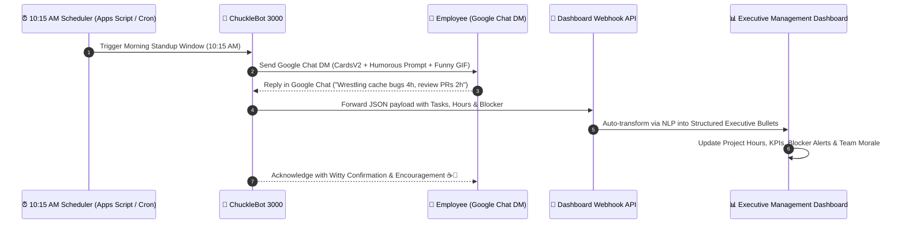

# 🤖 ChucklePulse for Google Chat — Daily Humorous Standup Bot & Executive Management Suite

> **The ultimate Google Chat Standup Bot & Executive Dashboard:** Sends daily 10:00–10:30 AM Direct Messages (DMs) to each employee in **Google Chat** with humorous, curious prompts & funny GIFs — then collects their responses and transforms them into structured executive intelligence for leadership.

---

## 🌟 Google Chat Workflow & Architecture



---

## 🚀 Key Features

1. **⏰ 10:00 - 10:30 AM Google Chat DM Broadcaster**:
   - DMs each employee individually in their Google Chat 1:1 space with fresh, funny, and curious morning prompts.
   - Embeds work-safe reaction GIFs (coffee cat, matrix coding, bug-squashing fire, victory dances).
   - Zero-vulgarity corporate safety protocol.

2. **🪄 Real-Time AI Executive Transformer**:
   - Converts playful, casual Google Chat replies into clean executive bullet points, identified project allocations, and blocker alerts.

3. **👔 Executive Data Hub & Management Suite**:
   - Check-in rate metrics, total hours logged, workload distribution by initiative, and blocker resolution tracking.
   - 1-click **Export to CSV**, **JSON Data Download**, and **Copy Briefing for Email/Slack**.

4. **⚡ Zero-Cost Google Apps Script Deployment**:
   - Uses native Google Workspace Apps Script (`Code.gs`) with zero server hosting costs, or optional Node.js Google Chat service.

---

## 📂 Project Structure

```text
Greeting/
├── index.html                           # Google Chat Standup Suite & Executive UI
├── styles.css                           # Modern glassmorphism & Google CardsV2 styling
├── app.js                               # Google Chat engine, NLP parser & state
├── server.js                            # Web server & Google Chat webhook receiver
├── package.json                         # Node start scripts
├── google-chat-bot/                     # Dedicated Google Chat Bot Integration
│   ├── Code.gs                          # Production Google Apps Script code
│   ├── appsscript.json                  # Google Apps Script manifest
│   └── google-chat-node-bot.js          # Alternative Node.js Google Chat API daemon
└── README.md                            # Documentation & Google Workspace setup guide
```

---

## 🛠️ Step-by-Step Google Chat Bot Setup

### Step 1: Open Google Apps Script
1. Go to **[https://script.google.com](https://script.google.com)** and click **"New Project"**.
2. Name it **"ChucklePulse Google Chat Bot"**.

### Step 2: Paste `Code.gs` & `appsscript.json`
1. Copy the code from [**`google-chat-bot/Code.gs`**](file:///c:/Users/HP/OneDrive/Desktop/Greeting/google-chat-bot/Code.gs) into the Apps Script editor.
2. In Project Settings, check **"Show 'appsscript.json' manifest file in editor"** and paste the content from [**`google-chat-bot/appsscript.json`**](file:///c:/Users/HP/OneDrive/Desktop/Greeting/google-chat-bot/appsscript.json).
3. Set your `DASHBOARD_API_URL` and add your team's Google Workspace emails to `CONFIG.EMPLOYEE_EMAILS`.

### Step 3: Enable Google Chat API & Activate 10:15 AM Trigger
1. In Google Cloud Console, enable the **Google Chat API**.
2. Set the App Name to **"ChuckleBot 3000"**.
3. In Google Apps Script, select `setupDailyStandupTrigger` from the function dropdown and click **Run**.
4. That's it! Every weekday at 10:15 AM, ChuckleBot will automatically DM each employee in Google Chat!

---

## 💻 Local Testing

The web dashboard and webhook simulator are running at:

👉 **[http://localhost:3000](http://localhost:3000)**
